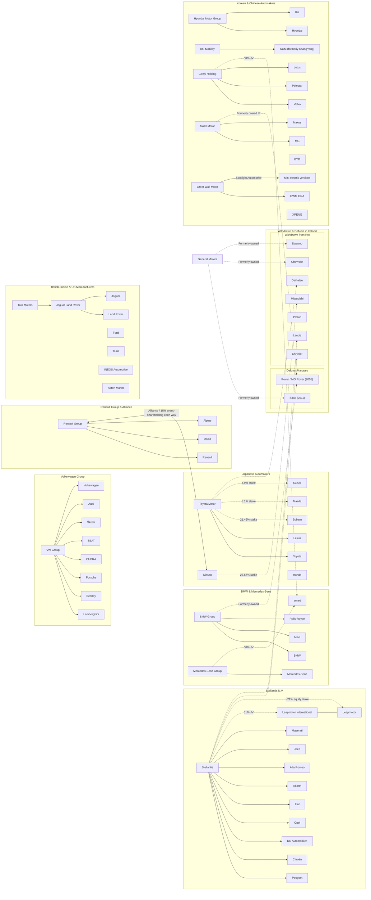

# car-diagrams
some graphs and diagrams of car related content

## Car brands sold in Ireland

```mermaid
flowchart LR
    %% REPUBLIC OF IRELAND AUTOMOTIVE MARKET
    %% Ownership, alliances, minority stakes and historical brands
    %% Solid arrows = ownership / group brands
    %% Dashed arrows = minority stake, JV or historical relationship

    subgraph VW_Group["Volkswagen Group"]
        direction LR
        VWG["VW Group"] --> VW["Volkswagen"]
        VWG --> Audi["Audi"]
        VWG --> Skoda["Škoda"]
        VWG --> SEAT["SEAT"]
        VWG --> Cupra["CUPRA"]
        VWG --> Porsche["Porsche"]
        VWG --> Bentley["Bentley"]
        VWG --> Lamborghini["Lamborghini"]
    end

    subgraph Stellantis_Group["Stellantis N.V."]
        direction LR
        ST["Stellantis"] --> Peugeot["Peugeot"]
        ST --> Citroen["Citroën"]
        ST --> DS["DS Automobiles"]
        ST --> Opel["Opel"]
        ST --> Fiat["Fiat"]
        ST --> Abarth["Abarth"]
        ST --> Alfa["Alfa Romeo"]
        ST --> Jeep["Jeep"]
        ST --> Maserati["Maserati"]
        ST -.->|51% JV| LPMI["Leapmotor International"]
        LPMI --- Leapmotor["Leapmotor"]
    end

    subgraph German_Other["BMW & Mercedes-Benz"]
        direction LR
        BMWGrp["BMW Group"] --> BMW["BMW"]
        BMWGrp --> MINI["MINI"]
        BMWGrp --> RollsRoyce["Rolls-Royce"]

        MBGrp["Mercedes-Benz Group"] --> MB["Mercedes-Benz"]
        MBGrp -.->|50% JV| Smart["smart"]
    end

    subgraph Japanese["Japanese Automakers"]
        direction LR
        ToyotaGrp["Toyota Motor"] --> Toyota["Toyota"]
        ToyotaGrp --> Lexus["Lexus"]
        ToyotaGrp -.->|21.46% stake| Subaru["Subaru"]
        ToyotaGrp -.->|5.1% stake| Mazda["Mazda"]
        ToyotaGrp -.->|4.9% stake| Suzuki["Suzuki"]

        Honda["Honda"]
        Nissan["Nissan"]
    end

    subgraph Renault_Alliance["Renault Group & Alliance"]
        direction LR
        RenaultGrp["Renault Group"] --> Renault["Renault"]
        RenaultGrp --> Dacia["Dacia"]
        RenaultGrp --> Alpine["Alpine"]
    end

    subgraph Korean_Chinese["Korean & Chinese Automakers"]
        direction LR
        HyundaiGrp["Hyundai Motor Group"] --> Hyundai["Hyundai"]
        HyundaiGrp --> Kia["Kia"]

        KGMGrp["KG Mobility"] --> KGM["KGM (formerly SsangYong)"]

        Geely["Geely Holding"] --> Volvo["Volvo"]
        Geely --> Polestar["Polestar"]
        Geely --> Lotus["Lotus"]
        
        SAIC["SAIC Motor"] --> MG["MG"]
        SAIC --> Maxus["Maxus"]

        BYD["BYD"]

        GWM["Great Wall Motor"] --> Ora["GWM ORA"]
        GWM --> |Spotlight Automotive| eMINI["Mini electric versions"]
        Xpeng["XPENG"]

        Leapmotor["Leapmotor"]
    end

    subgraph UK_India_US["British, Indian & US Manufacturers"]
        direction LR
        Tata["Tata Motors"] --> JLR["Jaguar Land Rover"]
        JLR --> Jaguar["Jaguar"]
        JLR --> LandRover["Land Rover"]

        Ford["Ford"]
        Tesla["Tesla"]
        Ineos["INEOS Automotive"]
        Aston["Aston Martin"]
    end

    subgraph Historical["Withdrawn & Defunct in Ireland"]
        direction LR
        subgraph Withdrawn["Withdrawn from RoI"]
            direction LR
            MitsubishiW["Mitsubishi"]
            Chrysler["Chrysler"]
            Lancia["Lancia"]
            DaihatsuW["Daihatsu"]
            Proton["Proton"]
            Chevrolet["Chevrolet"]
            Daewoo["Daewoo"]
        end

        subgraph Defunct["Defunct Marques"]
            direction LR
            Saab["Saab (2011)"]
            Rover["Rover / MG Rover (2005)"]
        end
    end

    %% Renault-Nissan Alliance
    RenaultGrp <-->|Alliance / 15% cross-shareholding each way| Nissan

    %% Smart joint venture
    Geely -.->|50% JV| Smart

    %% Leapmotor equity relationship
    ST -.->|~21% equity stake| Leapmotor

    %% Historical ownership / brand relationships
    ToyotaGrp -.-> DaihatsuW
    ST -.-> Chrysler
    ST -.-> Lancia
    Nissan -.->|26.67% stake| MitsubishiW
    SAIC -.->|Formerly owned IP| Rover
    GM["General Motors"] -.->|Formerly owned| Saab
    GM -.->|Formerly owned| Chevrolet
    GM -.->|Formerly owned| Daewoo
    BMWGrp -.->|Formerly owned| Rover


```
